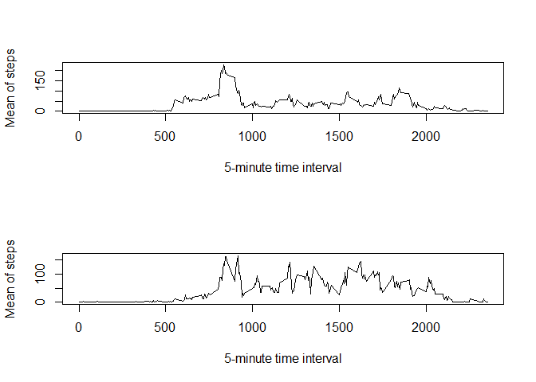

# Reproducible Research: Peer Assessment 1


## Loading and preprocessing the data

This script uses dplyr for summarising data frames. Therefore we need to load the necassary library.


```r
library(dplyr)
```

```
## Warning: package 'dplyr' was built under R version 3.2.2
```

```
## 
## Attaching package: 'dplyr'
## 
## Die folgenden Objekte sind maskiert von 'package:stats':
## 
##     filter, lag
## 
## Die folgenden Objekte sind maskiert von 'package:base':
## 
##     intersect, setdiff, setequal, union
```

The data is included as a zip file. I needed to unzip it and load the data afterwards. Since we are working with dates I converted the dates as well.


```r
unzip("activity.zip")
raw_data <- read.csv("activity.csv")
proc_data <- raw_data
proc_data$date <- as.POSIXct(raw_data$date)
```

## What is mean total number of steps taken per day?

For aggregating the number of steps per day I used the dplyr package. First I converted it to an dplyr data frame. I created a new data frame with the data grouped by date and a sum_steps variable for the total number of steps per day.


```r
df_data <- tbl_df(proc_data)

aggregated_by_day <- df_data %>% 
    group_by(date) %>% 
    summarise(
        sum_steps = sum(steps, na.rm = TRUE)
    )
```

The following plot shows a histogram of the total number of steps per day:


```r
hist(aggregated_by_day$sum_steps)
```

 

As can be seen in the plot most of the days have a total step count between 10 0000 and 15 000.

And the mean and median for the total number of steps per day are:


```r
mean(aggregated_by_day$sum_steps)
```

```
## [1] 9354.23
```

```r
median(aggregated_by_day$sum_steps)
```

```
## [1] 10395
```

## What is the average daily activity pattern?

To get a view on the daily activity pattern I have summarised the data by 5-minute time interval. Again I used the dplyr package.


```r
aggregated_by_interval <- df_data %>%
    group_by(interval) %>%
    summarise(mean_steps = mean(steps, na.rm =TRUE))
```

Then next plot shows the mean steps per time interval:


```r
plot(aggregated_by_interval$interval, aggregated_by_interval$mean_steps, type="l")
```

 

As can be seen in the plot the maximum of activity is around 9 o'clock. The exact maximum is at:


```r
aggregated_by_interval$interval[aggregated_by_interval$mean_steps == max(aggregated_by_interval$mean_steps)]
```

```
## [1] 835
```

## Imputing missing values

The number of cases with NA values are:


```r
sum(!complete.cases(df_data))
```

```
## [1] 2304
```

I imputed the missing values with the mean for the time interval.


```r
imputed_data <- proc_data
for(row in 1:nrow(imputed_data)) {
    if(is.na(imputed_data[row, "steps"])) {
        impute <- aggregated_by_interval$mean_steps[aggregated_by_interval$interval == imputed_data[row, "interval"]]
        imputed_data[row, "steps"] <- impute
    }
}
```

To compare the imputed data with the original data set. I summarised the new data accordingly.


```r
df_imputed <- tbl_df(imputed_data)

imp_agg_by_day <- df_imputed %>% 
    group_by(date) %>%
    summarise(
        sum_steps = sum(steps, na.rm = TRUE)
    )
```

The histogram for the total number of steps per day shows more total steps. This is not suprising as imputing added many steps.


```r
hist(imp_agg_by_day$sum_steps)
```

 

The mean and median are higher than in the original data set.


```r
mean(imp_agg_by_day$sum_steps)
```

```
## [1] 10766.19
```

```r
median(imp_agg_by_day$sum_steps)
```

```
## [1] 10766.19
```

If I had imputed the data with the mean of total steps per day, the mean of total steps per day should not have changed.

## Are there differences in activity patterns between weekdays and weekends?

To create a weekday variable, I used the wday of the POSIXlt date format, because the weekday funtion is local specific.


```r
wday <- as.POSIXlt(imputed_data$date)$wday
imputed_data$weekday <- sapply(wday, function(x) {ifelse(x > 0 && x < 6, 1, 0)} )
imputed_data$weekday <- factor(imputed_data$weekday, levels=c(0,1), labels=c("weekend","weekday"))
```

Then I created a summarised data set and two logical vectors for weekdays and weekend.


```r
df_imputed <- tbl_df(imputed_data)

imp_agg_by_interval <- df_imputed %>%
    group_by(interval, weekday) %>%
    summarise(mean_steps = mean(steps, na.rm =TRUE))

weekdays <- imp_agg_by_interval$weekday == "weekday"
weekend <- !weekdays
```

Last I plotted the daily activity patterns for both subsets:


```r
par(mfcol=c(2,1))
plot(imp_agg_by_interval$interval[weekdays], imp_agg_by_interval$mean_steps[weekdays], type="l")
plot(imp_agg_by_interval$interval[weekend], imp_agg_by_interval$mean_steps[weekend], type="l")
```

 

The comparision shows less activity on weekends before the peek around 9. While the peek never reaches the same height as weekdays. And during the weekend the activity level dies down later in the day.
